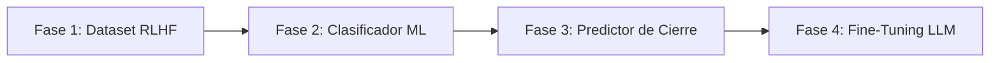

# 🏦 CPS Sales Copilot — Commercial & RevOps Strategy Engine

Bienvenido al espacio de trabajo enfocado en la estrategia comercial, arquitectura de ventas y Caso de Negocio para **CPS Sales Copilot** (Core Bancario e Infraestructura Fintech para SOFOMes y Arrendadoras en México).

---

## 📌 Contexto Estratégico

- **Objetivo Principal (Q3-Q4):** +$200,000 MXN en MRR y +20 clientes nuevos de aquí a diciembre.
- **ICP Target:** SOFOMes (40%) y Arrendadoras Financieras (30%) en México.
- **Modelo de Precios:** Renta Mensual (MRR) según proyecto (referencia promedio $50,000 MXN/mes) + Setup Fee equivalente a **2x la Renta Mensual** del proyecto.
- **Competidor Principal:** DynamiCore.
- **Fechas Clave:**
  - **27 de Julio:** Sesión de revisión del Caso de Negocio con Luis (CEO & Co-founder de Fintech Bar).
  - **3 de Agosto:** Fecha proyectada de inicio oficial.

---

## 📁 Archivos y Estructura del Proyecto

- 💻 **[index.html](file:///c:/Users/Antonio/.gemini/antigravity-ide/scratch/CPS Sales Copilot/index.html)** — **Pitch Deck Web Interactivo (Smart Native®)** con calculadora de TCO en vivo, tarjetas de 4 Pilares y línea de tiempo.
- 📊 **[PRESENTACION_EJECUTIVA_SLIDES.md](file:///c:/Users/Antonio/.gemini/antigravity-ide/scratch/CPS Sales Copilot/PRESENTACION_EJECUTIVA_SLIDES.md)** — Estructura de diapositivas ejecutivas (McKinsey SCQA / Ghost Deck Test) mapeada con las plantillas ZIP descargadas (`ceo-ready-deck-polish.zip`).
- 📄 **[BUSINESS_CASE_CPS Sales Copilot.md](file:///c:/Users/Antonio/.gemini/antigravity-ide/scratch/CPS Sales Copilot/BUSINESS_CASE_CPS Sales Copilot.md)** — Propuesta ejecutiva, Win-Analysis del portafolio actual, Unit Economics, propuesta de valor (4 Pilares + Ecosistema de Aliados) y Plan 30-60-90 días.
- 🛠️ **[DOMINIO_ENTREGABILIDAD_DNS_PLAYBOOK.md](file:///c:/Users/Antonio/.gemini/antigravity-ide/scratch/CPS Sales Copilot/DOMINIO_ENTREGABILIDAD_DNS_PLAYBOOK.md)** — Playbook técnico paso a paso de autenticación DNS (SPF, DKIM, DMARC, Warmup y dominios satélite).
- 🧠 **[SALES_COPILOT_AND_OBSIDIAN_BRAIN.md](file:///c:/Users/Antonio/.gemini/antigravity-ide/scratch/CPS Sales Copilot/SALES_COPILOT_AND_OBSIDIAN_BRAIN.md)** — Estrategia de Sales Enablement: Bóveda de Obsidian (`CPS Sales Copilot Brain`) y Copiloto de Ventas asistido por IA para ejecutivos comercial.
- 📄 **[PLAYBOOK_DESCONGELAMIENTO_PIPELINE.md](file:///c:/Users/Antonio/.gemini/antigravity-ide/scratch/CPS Sales Copilot/PLAYBOOK_DESCONGELAMIENTO_PIPELINE.md)** — Estrategia de re-engagement, oferta de migración sin doble costo, garantía Go-Live 30 días y manejo de objeciones.
- 📄 **[TEARDOWN_DYNAMICORE.md](file:///c:/Users/Antonio/.gemini/antigravity-ide/scratch/CPS Sales Copilot/TEARDOWN_DYNAMICORE.md)** — Matriz comparativa, TCO a 12 meses (ahorro del 45%) y Battlecard de ventas vs. DynamiCore.
- 📊 **[data/sofomes_arrendadoras_mx.csv](file:///c:/Users/Antonio/.gemini/antigravity-ide/scratch/CPS Sales Copilot/data/sofomes_arrendadoras_mx.csv)** — Base de datos calificada de SOFOMes y Arrendadoras en México con contactos clave y estado en el funnel.
- ⚔️ **[MATRIZ_COMPETITIVA_Y_BATTLECARDS.md](file:///c:/Users/Antonio/.gemini/antigravity-ide/scratch/CPS Sales Copilot/MATRIZ_COMPETITIVA_Y_BATTLECARDS.md)** — Matriz exhaustiva de los 3 segmentos (Onboarding/KYC, Cores Internacionales y Cores Locales) con Battlecards de desplazamiento para AEs.
- 📊 **[DECK_COMPETENCIA_SLIDES.md](file:///c:/Users/Antonio/.gemini/antigravity-ide/scratch/CPS Sales Copilot/DECK_COMPETENCIA_SLIDES.md)** — Deck corto de 5 diapositivas ejecutivas listo para presentar (McKinsey SCQA) alimentado por la matriz CSV.
- 🕶️ **[PLAYBOOK_ROL_AE_BLACK_OPS.md](file:///c:/Users/Antonio/.gemini/antigravity-ide/scratch/CPS Sales Copilot/PLAYBOOK_ROL_AE_BLACK_OPS.md)** — Propuesta pragmática del rol de AE: pitch en 2 capas, 5 tácticas de targeting individual y mapa de deficiencias objetivas.
- 🧠 **[MATRIZ_COMPARATIVA_RESPUESTAS_LLM.md](file:///c:/Users/Antonio/.gemini/antigravity-ide/scratch/CPS Sales Copilot/MATRIZ_COMPARATIVA_RESPUESTAS_LLM.md)** — Comparativa analítica de los aportes estratégicos de Claude, Perplexity y Kimi para la llamada con Luis.
- ⚙️ **[.agents/AGENTS.md](file:///c:/Users/Antonio/.gemini/antigravity-ide/scratch/CPS Sales Copilot/.agents/AGENTS.md)** — Reglas del agente e instrucciones de RevOps / MEDDIC.

---

## 🚀 Roadmap de Evolución a Machine Learning (ML Engine)

Para evolucionar el motor de **CPS Sales Copilot** desde las reglas deterministas iniciales hacia una inteligencia predictiva adaptativa, se define la siguiente hoja de ruta en 4 fases:

### 1. 📊 Fase 1: Recolección & Curaduría de Dataset RLHF *(En Progreso)*
- **Mecanismo:** Registro automático de transcripciones y retroalimentación ejecutiva a 1-clic (`🟢 Avanzó a PoC`, `🟡 Seguimiento`, `🔴 Sin Cierre`) guardado en `rlhf_sales_dataset.jsonl` e `insights_reunion_*.jsonl`.
- **Meta:** Acumular entre **200 y 500 interacciones reales etiquetadas** para garantizar la calidad del dataset de entrenamiento.

### 2. 🧠 Fase 2: Clasificador de Objeciones Semánticas *(Supervised ML)*
- **Objetivo:** Sustituir la coincidencia por palabras clave (`evaluate_cps_rules`) por un clasificador semántico en `scikit-learn` / `fastText`.
- **Impacto:** Clasificación precisa de objeciones implícitas o coloquiales (*"está muy pesado el costo"*, *"ahorita no aplica para nosotros"*, *"hay que validarlo con el comité"*).

### 3. 📈 Fase 3: Predictor de Probabilidad de Cierre en Tiempo Real
- **Objetivo:** Modelo predictivo (XGBoost / LightGBM) entrenado sobre el historial de conversaciones.
- **Impacto:** Estimación en vivo del % de probabilidad de avance a PoC o Cierre durante la reunión según la progresión del diálogo y el manejo socrático.

### 4. 🎯 Fase 4: Fine-Tuning de LLM Especializado *(LoRA / QLoRA)*
- **Objetivo:** Fine-tuning de un modelo open-source (Llama 3 / Mistral) en pares de objeción y re-encuadre socrático con terminología financiera/fintech mexicana.

---
*Estructurado para la Célula de Agentes Globales de Antonio Gutiérrez.*

