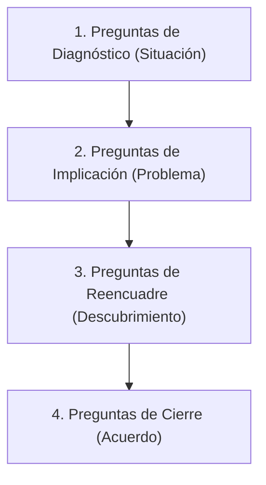

# Guía Rápida: Método Socrático en Ventas B2B

**Tag**: #sales-framework #mayeutica #socratic-selling
**Navegación**: [[Mayeutica MOC]] | [[Portafolio/Antonio_Gutierrez_Perfil|Antonio_Gutierrez_Perfil]]

El método [[README|socrático en ventas consiste]] en **liderar al cliente hacia la solución a [[Libros/El_Arte_de_Hacer_Preguntas_Mario_Borghino_Resumen|través de preguntas estratégicas]]**, en lugar [[Libros/The_Socratic_Method_Ward_Farnsworth_Resumen|de presentar características técnicas]] de forma unilateral. El objetivo es que el cliente verbalice su propio problema y el costo de no resolverlo.

---

## 🧭 Las 4 Fases del Diálogo Socrático en Ventas

### 1. Preguntas de Diagnóstico (Descubrir la Realidad)
*Evita asumir. Haz [[Libros/Socrates_10_Claves_Filco_Web|preguntas abiertas para entender]] cómo operan actualmente.*
*   *¿Cómo [[Libros/El Arte de Hacer Preguntas Mario Borghino|gestionan actualmente el flujo]] de cobros de sus cuentas de alto valor?*
*   *¿Qué métrica de su pasarela de pagos actual les preocupa más en este trimestre?*
*   *¿Cuál es el proceso interno cuando una transacción Enterprise es rechazada?*

### 2. Preguntas de Implicación (Hacer doler el problema)
*El cliente debe entender el costo financiero y operativo de mantener el statu quo.*
*   *Si la tasa de rechazo actual se mantiene en 15%, ¿qué impacto financiero representa a final de año?*
*   *¿Cuánto tiempo del equipo de operaciones se consume resolviendo aclaraciones manualmente?*
*   *¿Cómo afecta la fricción del cobro en la retención de sus clientes recurrentes?*

### 3. Preguntas de Reencuadre (Mayéutica)
*Ayudan al cliente a ver la solución por sí mismo, cuestionando sus suposiciones.*
*   *Si existiera una forma de automatizar el reintento de cobros rechazados sin intervención humana, ¿cómo cambiaría su proyección de MRR?*
*   *¿Qué pasaría si pudieran identificar en tiempo real la causa exacta del rechazo de un pago de alto valor?*

### 4. Preguntas de Cierre (Autocompromiso)
*El cliente cierra la venta por ti.*
*   *Basado en lo que analizamos, ¿cuál cree que debería ser el siguiente paso para detener esa fuga de ingresos?*
*   *¿Tendría sentido agendar una sesión técnica para ver cómo integrar esta solución a su flujo actual?*

---

## ⚡ Reglas de Oro Socráticas
1.  **Regla 80/20**: El cliente habla el 80% del tiempo, tú el 20%.
2.  **No debatas las objeciones**: Si el cliente dice *"Es muy caro"*, reencuadra con: *¿Caro comparado con qué beneficio?* o *¿Qué impacto tendría en su negocio si resolvemos esto a mitad de precio pero con el doble de tasa de rechazo?*
3.  **El Silencio es tu Aliado**: Después de una pregunta de implicación difícil, guarda silencio. Deja que el cliente piense y responda.

---

## 📚 Bibliografía de Referencia en esta Bóveda
*   Para profundizar en el control de la conversación y el reencuadre, ver: [[Libros/El_Arte_de_Hacer_Preguntas_Resumen|El_Arte_de_Hacer_Preguntas_Resumen]] por **Mario Borghino**.
*   Para la aplicación práctica del método a cierres de alto valor, ver: [[Libros/VentasSocraticasSafra|VentasSocraticasSafra]] por **Safra**.
