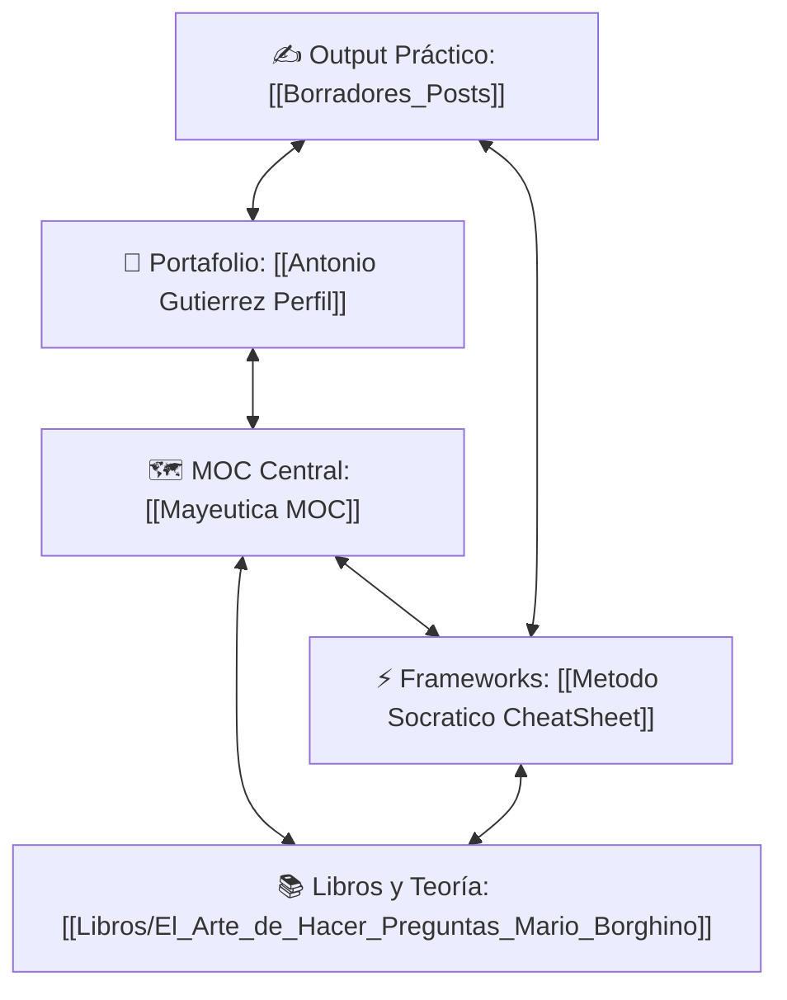

# 🗺️ Mapa de Contenido: Mayéutica y Dialéctica (Ventas Socráticas)

**Tag**: #moc #filosofia-ventas #dashboard
**Última Actualización**: 2026-07-04

Bienvenido al centro de control conceptual de tu bóveda. Este mapa [[README|de contenido (MOC) estructura]] y [[Libros/Las Reglas Sandler|conecta las notas teóricas]] de los libros de persuasión con tus herramientas de venta prácticas y tu perfil comercial.

---

## 📌 Arquitectura del Grafo (Conexiones Principales)

En la **Vista de Grafo de Obsidian** (Ctrl + G), verás cómo se enlazan estos cuatro grandes pilares:

---

## 👤 1. Quién Vende (Tu Identidad Comercial)
*   **Perfil de Estratega:** [[Antonio Gutierrez Perfil]] (Tu stack de Fintech, MRR y experiencia en Clip/Fiserv).
*   **CV en Texto:** [[Antonio Gutierrez CV Texto]] (Tus logros detallados listos para ser adaptados).

## ⚡ 2. Cómo se Vende (Metodología Práctica)
*   **Estrategia Socrática:** [[Metodo Socratico CheatSheet]]
    *   *Fase 1:* [[Metodo Socratico CheatSheet#1. Preguntas de Diagnóstico (Descubrir la Realidad)]]
    *   *Fase 2:* [[Metodo Socratico CheatSheet#2. Preguntas de Implicación (Hacer doler el problema)]]
    *   *Fase 3:* [[Metodo Socratico CheatSheet#3. Preguntas de Reencuadre (Mayéutica)]]
    *   *Fase 4:* [[Metodo Socratico CheatSheet#4. Preguntas de Cierre (Autocompromiso)]]

## 📚 3. De Dónde Viene (Fundamentos Teóricos)

### 🏛️ Filosofía y Pedagogía Socrática
*   **10 Claves de Sócrates:** [[Libros/Socrates_10_Claves_Filco_Web|Sócrates: 10 claves para entender su filosofía (Filco)]]
*   **[[The Socratic Method Ward Farnsworth]]):** [[Libros/The_Socratic_Method_Ward_Farnsworth|The Socratic Method: Unlocking Wisdom Through Inquiry]]
*   **Pedagogía Socrática (GoStudent):** [[Libros/Metodo_Socratico_Ensenanza_Pedagogia|El Método Socrático en la Enseñanza y Pedagogía]]

### 📈 Metodologías de Ventas Socráticas y Consultivas
*   **Filosofía Comercial (Felipe Pérez de Madrid):** [[Libros/Filosofia_Comercial_Socrates_Cierre_YouTube|De Sócrates al Cierre de Ventas (Charla YouTube)]]
*   **Ventas Socráticas (Banco Safra / ERC Selling):** [[Libros/Ventas_Socraticas_Safra|Ventas Socráticas Safra: Técnicas de Indagación]]
*   **[[SPIN Selling Neil Rackham]]):** [[Libros/SPIN_Selling_Neil_Rackham|SPIN Selling: Situación, Problema, Implicación y Necesidad]]
*   **Sandler Training (David H. Sandler):**
    *   *Libro Core:* [[Libros/No_Puedes_Ensenar_Bicicleta_Seminario_Sandler|No Puedes Enseñar a un Niño a Andar en Bicicleta en un Seminario]]
    *   *Metodología Corporativa:* [[Libros/Sandler_Training_Metodologia_Comercial|Sandler Training: Triángulo del Éxito y Gestión de Ventas]]
*   **[[El Arte de Hacer Preguntas Mario Borghino]]):** [[Libros/El_Arte_de_Hacer_Preguntas_Mario_Borghino|El Arte de Hacer Preguntas: Estrategias de Indagación Reflexiva]]

## ✍️ 4. Lo que se Produce (Borradores y Guiones)
*   *Los guiones generados por tu Bot de Telegram se guardarán automáticamente en tu espacio de trabajo y se conectarán con:*
    *   La técnica utilizada (ej: [[Metodo Socratico CheatSheet]])
    *   Tu perfil (ej: [[Antonio Gutierrez Perfil]]) para mantener la congruencia de marca personal.

